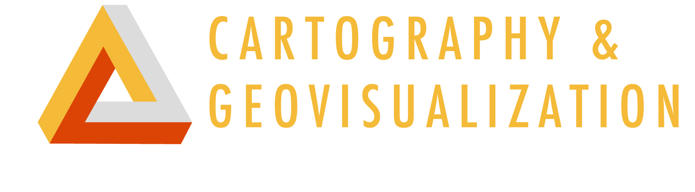
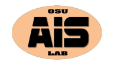
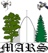

## Web Visualizing a LiDAR Point Cloud of a Stand in the McDonald-Dunn Forest
#### Bryan Begay, Thomas Braun, Katie Nicolato || Oregon State University Cartography and Geovisualization Group


</br>

### About

This geovisualization displays a coniferous forest stand in the McDonald-Dunn forest northwest of Corvallis, OR, USA. This stand is near the Lewisburg Saddle, a popular recreation area hosting hiking and mountain biking trails. The McDonald-Dunn is a research forest owned by Oregon State University.
</br>

We feature a 3D LiDAR point cloud (Light Detection and Ranging) overlaid onto a terrain map with a toolbar for manipulating the visualization. Several geovisualization tools communicate the stand features:

> * Unmanned Aerial System video footage of the stand familiarizes the user with the environment</br>
> * A 3D LiDAR cloud enables 360-degree stand visualization, quantification and immersion</br>
> * A topographic terrain model orients the stand in context with Willamette Valley geography</br>

This geovisualization serves both science communication and quantitative purposes. We designed the project template as an adaptable tool for future forest stand visualization.

### Goal

Our project goal was to visualize a LiDAR point cloud of a forest stand with terrain elements. This project stems from research creating point cloud visualization models to ensure maximized forest aesthetics. Point clouds capture high detail stand structure. Managers can use these models to pre-visualize timber harvests by simulating specific tree removal. An important element for this visualization is terrain. Depending on the terrain and residual structure of the post-harvest stand, it is possible to occlude or hide a timber harvest to increase forest aesthetics. We were initially interested in integrating a forest point cloud with a viewshed analysis tool utilizing terrain. Our base goal was to overlay a point cloud on a 3D terrain map for web visualization. Future development could include a viewshed analysis tool. The project template is adaptable for future forest stand visualization.

### Technical Summary

Light Detection and Ranging explanation

**System Architecture**

We converted the LiDAR point cloud file into a web format using the [Potree Converter]() tool.

>Example Potree Conversion command:

>``` PotreeConverter.exe assets/merge.las -o web  --projection "+proj=utm +zone=10 +ellps=GRS80 +datum=NAD83 +units=m +no_defs" -o web -p index ```

We consequently projected the 3D forest stand onto a digital surface model provided by Cesium 3D World Viewer

We used Webslides format

**Functions** of your web map using either screenshots of the web map or a code snippet of the function

This geovisualization serves both science communication and quantitative purposes.

### Concept
**Vision**</br>

</br>
</br>
**Visualization**</br>


### Design Scheme

We used Webslides to create a 4-slide visualization:

> Slide 1 introduces the visualization and hosts Unmanned Aerial System footage of the target forest stand.</br>
> Slide 2 </br>
> Slide 3 </br>
> Slide 4 </br>

### Data Sources

LiDAR point cloud files (.las) were acquired from the [Oregon Department of Geology and Mineral Industries (DOGAMI) Lidar Viewer.](https://gis.dogami.oregon.gov/maps/lidarviewer/)</br>

Developers acquired aerial video footage of the target forest stand with a [DJI Phantom 4](https://www.dji.com/phantom-4) Unmanned Aerial System.</br>

### Libraries

### Web Services
[Potree Converter](https://github.com/potree/PotreeConverter) transforms the .las cloud file into a web-friendly format.</br>
[Potree Viewer](http://potree.org/) renders the forested point cloud.</br>
[Cesium ion](https://cesium.com/) renders the terrain map.</br>
[GitHub](https://github.com/) hosts the visualization.</br>

### Developers

[Bryan Begay](https://github.com/gimbalmonkey), Forest Engineering, Resources and Management, Oregon State University</br>
[Thomas Braun](https://thomaspbraun.com), College of Earth, Ocean, and Atmospheric Sciences, Oregon State University</br>
[Katie Nicolato](https://github.com/kitnixx), Forest Engineering, Resources and Management, Oregon State University</br>

### Acknowledgements

[Dr. Bo Zhao](https://ceoas.oregonstate.edu/profile/zhao/), GEOG 572 Geovisual Analytics Instructor, Oregon State University</br>
[Cartography and Geovisualization Group,](https://geoviz.ceoas.oregonstate.edu/) Oregon State University </br>
[Aerial Information Systems Lab,](http://ais.forestry.oregonstate.edu/) Oregon State University</br>
[Management Algorithms and Remote Sensing Lab,](http://mars.forestry.oregonstate.edu/) Oregon State University</br>
[Oregon Lidar Consortium](https://www.oregongeology.org/lidar/)</br>
